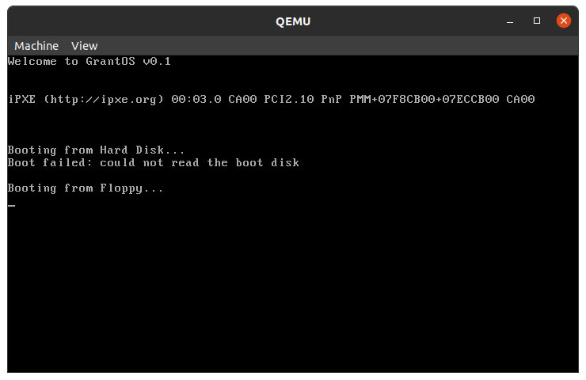

# GrantOS

>x86 cmd line OS by GTB using code from https://github.com/GaryTheBlobfish/Bootloader_x86  

## BUILD

> On Linux (Ubuntu):
>  - Go into the terminal and cd to the directory in which you have downloaded the code  
>  - type 'make' into the cmd line and GrantOS will open up  
